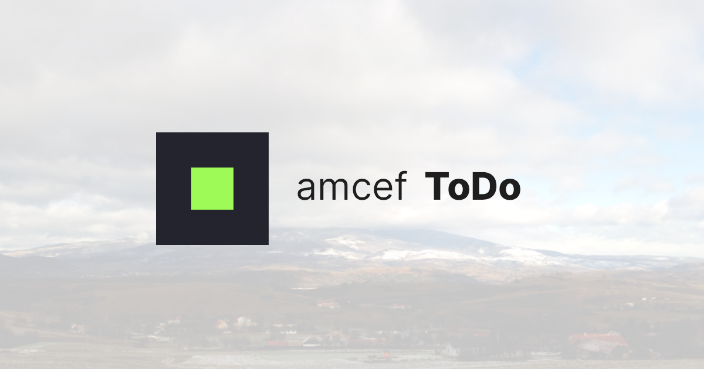
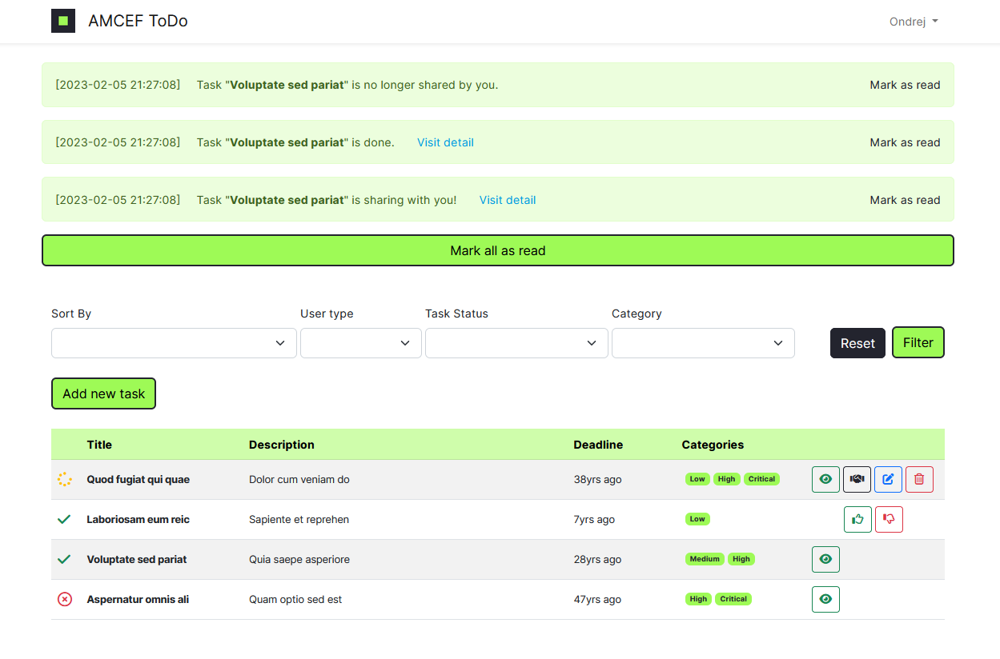
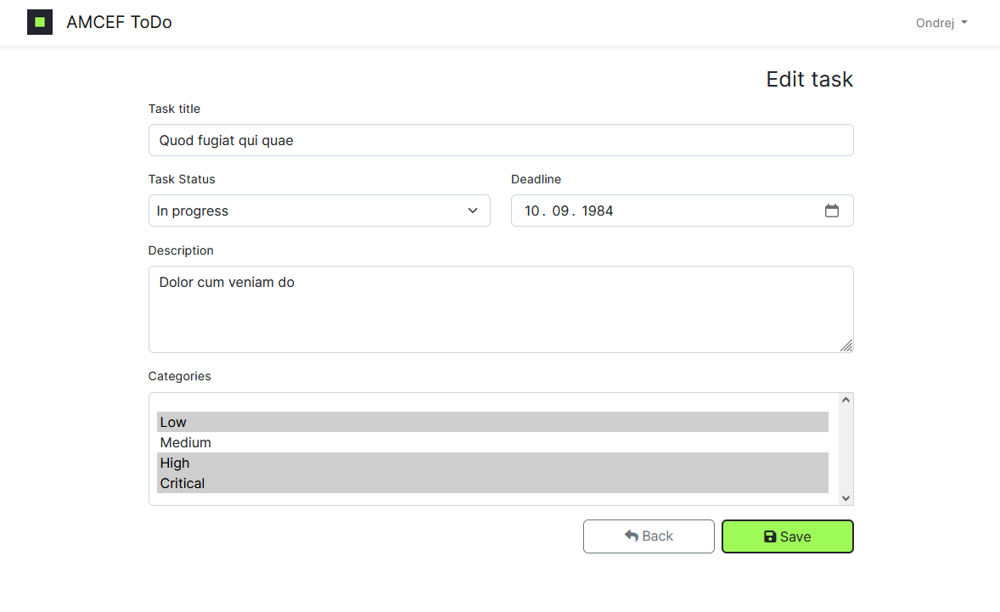
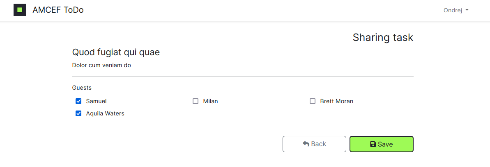

<p align="center"></p>

# Simple ToDo app

The application was created as a test project in one weekend. May contain errors. I will be glad if you draw my attention to it.

## Assignment

### Create a simple ToDo app in Laravel that should contain:
- [x] Registration and login (auth)
- [x] Creating ToDo items
- [x] Sharing ToDo items with other users (+ cancellation of sharing)
- [x] Classification of items into categories (can be static but stored in DB, at least 3)
- [x] Marking items as completed
- [x] Editing items (name, description...)
- [x] Deleting items + undo (in case of unwanted deletion)
- [x] Filtering by category, by whether they are completed, by whether they are mine or shared
- [x] Sending emails/notifications - when sharing items, marking done, etc.

### Static app (for fullstack developer):
- [x] Using HTML + Custom (SCSS/LESS/SASS - not pure CSS)/Bootstrap/Material/Tailwind
- [x] Logically structured views

### REST API (for backend developer):
- [ ] Auth must be stateless according to REST principles
- [ ] Comply with REST principles
- [ ] Add pagination to the list of ToDo items

### Other:
- [x] code purity
- [x] using the right patterns, styles, functions and principles of the language.

### In addition:
- [x] Policy implementation for individual actions
- [x] Notifications to the database and email
- [x] displaying notifications in the main application window and hiding them
- [x] work with the date in the form
- [x] record sorting
- [x] custom bootstrap css
- [x] nice status icons
- [x] minified html code using middlerware
- [x] created instruction manual with image for social media
- [x] use of the package to reduce the number of requests to google fonts
- [x] multilingual forms

# installation and basic settings

### Order of commands
```bash
git clone https://github.com/OndrejVrto/amcef.todo
cd amcef.todo
cp .env.example .env
composer install
php artisan key:generate
php artisan storage:link
npm install
npm run build
```
### Example configuration in ```.env``` file
```bash
APP_NAME="AMCEF ToDo"
APP_ENV=production
APP_KEY=******
APP_DEBUG=true
APP_URL=https://amcef.todo
DEBUGBAR_ENABLED=false
GOOGLE_INLINE=true
# ...
DB_CONNECTION=mysql
DB_HOST=127.0.0.1
DB_PORT=3306
DB_DATABASE=amcef.todo
DB_USERNAME=root
DB_PASSWORD=
# ...
QUEUE_CONNECTION=database
# ...
MAIL_MAILER=smtp
MAIL_HOST=sandbox.smtp.mailtrap.io
MAIL_PORT=2525
MAIL_USERNAME=******
MAIL_PASSWORD=******
MAIL_ENCRYPTION=tls
MAIL_FROM_ADDRESS="amcef.todo@example.com"
MAIL_FROM_NAME="${APP_NAME}"
```

### Migrate with seeding data

```bash
# clean app with four custom categories
php artisan migrate:fresh --seed

# custom categories and three user acounts
php artisan migrate:fresh --seeder Database\Seeders\DatabaseSeederBasic

# seeder for all model and relationships
php artisan migrate:fresh --seeder Database\Seeders\DatabaseSeederFull
```

### Run Queue worker in separate console
```bash
php artisan queue:work
```

# Example Views
**Appearance in the Firefox browser**
https://amcef.todo
if is using Laragon.

## Posible logins from "full" seeder

***email:***  ```ondrej@example.com```
or  ```milan@example.com```
or  ```samuel@example.com```

***password:***  ```password```

## Main page


## Form for edit task


## Form for share task


# Credits

- [Ondrej Vrťo](https://github.com/OndrejVrto)

# License

The MIT License (MIT). Please see [License File](LICENSE.md) for more information.
